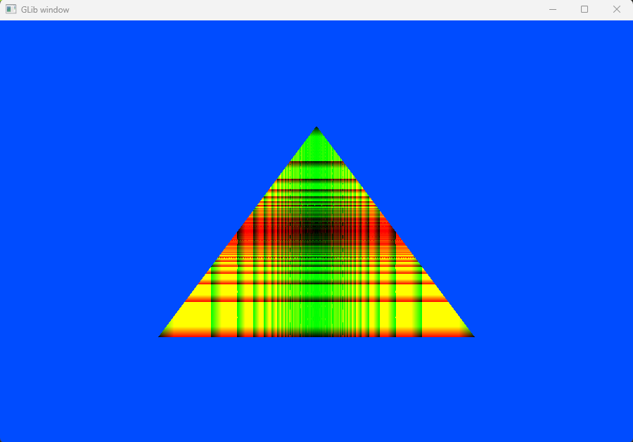

# Description
This header only library is an OpenGL ovarlay and also my learning process

I dev this project on [mysys2](https://www.msys2.org/) with "mysys2 ucrt x64 gcc"

## Build and run

```console
make main
./bin/main.exe
```

Build examples:
```console
make examples
./bin/"example_names".exe
```

## A little example code
A triangle with shader
```C
#define GLIB_IMPLEMENTATION
#include "../glib.h"

glib_obj_t* triangle_obj;
unsigned int my_shader;

void render(void){
    glib_use_shader(my_shader);
    glib_draw_obj(triangle_obj);
}

int main(){
    glib_init();
    glib_create_window(900, 600, "GLib window");
    glib_clear_color(0.0f, 0.3f, 1.0f, 1.0f);
    glib_set_render_callback(render);

    my_shader = glib_create_shader("./resources/shaders/shadering_example/main.vert", "./resources/shaders/shadering_example/main.frag");
    triangle_obj = glib_create_triangle_obj(0.0f,  0.5f, 0.5f, -0.5f, -0.5f,-0.5f);

    glib_main_loop();
    return 0;
}
```

__The output:__


## Dependencies
- [stb_image](https://github.com/nothings/stb/blob/master/stb_image.h)
- [glfw](https://www.glfw.org/)
- [glew](https://glew.sourceforge.net/)
- [cglm](https://github.com/recp/cglm)
- [make](https://www.gnu.org/software/make/)
